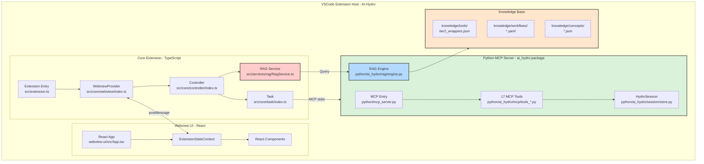

# AI-Hydro Extension Architecture & Development Guide

## Project Overview

AI-Hydro is a specialized VS Code extension (fork of Cline, Apache 2.0) that provides AI-powered assistance for hydrological data analysis and watershed modeling. The extension combines a TypeScript-based VS Code extension with a Python MCP server exposing 17 hydrological tools via the Model Context Protocol, enhanced with a RAG (Retrieval-Augmented Generation) system for intelligent tool discovery and knowledge retrieval.

## AI-Hydro Architecture Overview



## AI-Hydro Key Components

### 1. TypeScript Extension (Frontend)
- **Location**: `src/` directory
- **Purpose**: VSCode integration, user interface, task orchestration
- **Key Files**:
  - `src/extension.ts` - Extension entry point
  - `src/core/controller/index.ts` - State management and coordination
  - `src/core/task/index.ts` - Task execution and tool orchestration
  - `src/services/rag/RagService.ts` - RAG system integration

### 2. Python MCP Server (Core Analysis Engine)
- **Entry point**: `python/mcp_server.py` (thin wrapper → `ai_hydro.mcp`)
- **Purpose**: Hydrological analysis, data processing, tool execution via MCP protocol
- **17 MCP tools** organized in modular files:
  - `ai_hydro/mcp/tools_analysis.py` — 9 analysis tools (watershed, streamflow, signatures, geomorphic, TWI, CN grid, forcing, CAMELS, RAG search)
  - `ai_hydro/mcp/tools_session.py` — 6 session management tools
  - `ai_hydro/mcp/tools_modelling.py` — 2 modelling tools (HBV-light, NeuralHydrology)
- **Core computation packages**:
  - `ai_hydro/data/` — data retrieval (streamflow, forcing, landcover, soil)
  - `ai_hydro/analysis/` — computation (watershed, signatures, TWI, geomorphic, curve number)
  - `ai_hydro/modelling/` — model training (HBV-light, LSTM)
  - `ai_hydro/session/` — HydroSession persistent state management
  - `ai_hydro/rag/` — RAG concept search engine

### 3. RAG System (Intelligence Layer)
- **Location**: `python/ai_hydro/rag/` directory
- **Purpose**: Intelligent tool discovery and knowledge retrieval
- **Key Components**:
  - `rag/engine.py` - Main RAG orchestrator
  - `rag/config.py` - Configuration and path resolution
  - `registry/tool_registry.py` - Tool indexing and search
  - `registry/workflow_registry.py` - Workflow management
  - `registry/loader.py` - Knowledge base loader

### 4. Knowledge Base (Domain Expertise)
- **Location**: `knowledge/` directory
- **Purpose**: Structured hydrological knowledge and tool metadata
- **Contents**:
  - `tools/tier2_wrappers.json` - Metadata for analysis tools
  - `tools/tier3_tools.json` - Metadata for workflow tools
  - `workflows/*.yaml` - Workflow step definitions
  - `concepts/*.json` - Hydrological concepts and terminology
  - `python/ai_hydro/knowledge/camels_metadata.json` - CAMELS attribute definitions

### 5. Webview UI (User Interface)
- **Location**: `webview-ui/` directory
- **Purpose**: React-based user interface
- **Key Features**:
  - Chat interface for AI interaction
  - Task history and management
  - Settings and configuration
  - Real-time streaming updates

## AI-Hydro Specific Features

### RAG-Enhanced Tool Discovery

AI-Hydro implements a sophisticated RAG system that prevents AI hallucinations and provides intelligent tool recommendations:

```typescript
// In Task execution (TypeScript)
if (userMessage.includes("watershed") || userMessage.includes("delineate")) {
  // RAG system queries knowledge base
  const ragResult = await this.ragService.queryRag(userMessage)
  
  // AI receives validated tool recommendations
  // Example: "Use ai_hydro.tools.watershed.delineate_watershed()"
}
```

**Key RAG Features:**
1. **Tool Validation**: Verifies tools exist before recommending (`_validate_tool_exists()`)
2. **Keyword Matching**: Tokenizes queries and scores tools by relevance
3. **Context Injection**: Provides formatted guidance to AI
4. **Knowledge Retrieval**: Searches hydrological concepts and CAMELS metadata

### Tool Integration

AI-Hydro tools are exposed as **MCP tools** via the `ai-hydro` MCP server.
Always call them as MCP tools — never import them as Python functions.

**Important Distinction:**
- ✅ Call tools directly: `delineate_watershed(gauge_id="01031500")`
- ❌ Do NOT run Python scripts: `python -c "from ai_hydro.tools..."`
- ❌ Do NOT call `pip install` — dependencies are pre-installed

The Python library is the implementation layer — the MCP server is the interface.
All session management, file saving, and caching is handled automatically by MCP tools.

### Architecture

**MCP Server** (`python/mcp_server.py`) — 17 tools callable by any AI agent via stdio transport.
**Python Package** (`python/ai_hydro/`) — modular analysis, data, modelling, session, and RAG layers.
**External Data** — USGS NWIS, NHDPlus, GridMET, 3DEP, CAMELS via pygeohydro.

See `.clinerules/correct-tools.md` for the complete behavioral rules.

## Development Workflow

### Adding New Hydrological Tools

1. **Create the analysis function** in the appropriate `python/ai_hydro/` subpackage (data/, analysis/, modelling/)
2. **Add the MCP tool wrapper** as a `@mcp.tool()` function in `python/ai_hydro/mcp/tools_*.py`
3. **Update tests** in `python/tests/test_mcp_integration.py`
4. **Update documentation** in `docs/tools-reference.md` and this file
5. **(Optional)** Register as a plugin via `[project.entry-points."aihydro.tools"]` in `pyproject.toml`

### Extending the Knowledge Base

1. **Tools**: Edit `knowledge/tools/tier2_wrappers.json`
2. **Workflows**: Create YAML files in `knowledge/workflows/`
3. **Concepts**: Add to `knowledge/concepts/*.json`
4. **CAMELS Attributes**: Update `python/ai_hydro/knowledge/camels_metadata.json`

### Testing

```bash
# Run MCP integration tests (30 tests)
/opt/miniconda3/bin/python -m pytest python/tests/test_mcp_integration.py -v

# Verify all 17 tools register correctly
/opt/miniconda3/bin/python python/setup_mcp.py --check
```

## Key Differences from Base Cline

### 1. Domain-Specific Focus
- **Cline**: General-purpose AI coding assistant
- **AI-Hydro**: Specialized for hydrological analysis with 17 built-in MCP tools

### 2. Tool Architecture
- **Cline**: Generic MCP server support (user-configured)
- **AI-Hydro**: Pre-configured Python MCP server (`python/mcp_server.py`) with FastMCP, exposing 17 hydrological tools over stdio transport

### 3. Knowledge System
- **Cline**: No built-in domain knowledge
- **AI-Hydro**: Comprehensive RAG system with hydrological expertise (concepts, CAMELS metadata, tool documentation)

### 4. Session Management
- **Cline**: No persistent research state
- **AI-Hydro**: HydroSession system with per-gauge JSON persistence at `~/.aihydro/sessions/`, automatic caching of expensive computations

### 5. Dual Execution Model (MCP-First Fallback)
- **Cline**: All tools via MCP or terminal commands
- **AI-Hydro**: Instruction-based dual execution — MCP tools are the primary path; Python scripting via `execute_command` is the fallback for tasks without a dedicated MCP tool

## Dual Execution Model

AI-Hydro uses an **instruction-based MCP-first fallback system**. This is NOT automatic code-level routing — the AI agent reads instructions and decides which path to take.

### Rules (defined consistently in 3 sources)

1. **If an MCP tool exists for the task → use it.** Never substitute Python scripting.
2. **If no MCP tool exists → Python scripting via `execute_command` is the correct fallback.**
3. Never call `pip install` — dependencies are pre-installed.

### Instruction Sources

| Source | Location | Purpose |
|--------|----------|---------|
| Workspace rules | `.clinerules/correct-tools.md` | Loaded at conversation start |
| FastMCP instructions | `python/ai_hydro/mcp/app.py` | Embedded in MCP server handshake |
| RAG session init | `python/ai_hydro/rag/engine.py` | Injected during session initialization |

### Example

```
User: "Delineate the watershed for gauge 01031500"
→ AI uses MCP tool: delineate_watershed(gauge_id="01031500")

User: "Plot the hydrograph with a 7-day moving average"
→ No MCP tool for custom plotting → AI writes Python via execute_command
```

## Documentation Reference

For detailed information, see:
- **docs/architecture.md** - System architecture and data flow
- **docs/tools-reference.md** - All 17 MCP tools reference
- **.clinerules/correct-tools.md** - Tool usage rules (MCP-first fallback)
- **README.md** - Project overview and setup

## Contributing to AI-Hydro

When contributing to AI-Hydro:

1. **Maintain RAG Quality**:
   - Add comprehensive metadata for new tools
   - Use relevant keywords for search optimization
   - Include complete usage examples

2. **Follow Architecture**:
   - Keep tools in appropriate tier (2 or 3)
   - Use established patterns for tool implementation
   - Maintain separation between TypeScript and Python

3. **Test Thoroughly**:
   - Validate tool imports work
   - Test RAG query results
   - Verify workflow orchestration

4. **Document Changes**:
   - Update knowledge base files
   - Modify relevant documentation
   - Add examples for new features

## Best Practices

### For Python Tools
- Use type hints for all parameters
- Return structured dictionaries
- Handle errors gracefully
- Document data sources

### For Knowledge Base
- Write clear, searchable descriptions
- Use domain-specific keywords
- Provide complete usage examples
- Keep metadata synchronized with code

### For RAG Integration
- Test tool validation after changes
- Verify search returns expected results
- Monitor query performance
- Update knowledge base regularly

---

**AI-Hydro** | Intelligent Hydrological Analysis Platform | Fork of Cline (Apache 2.0)
