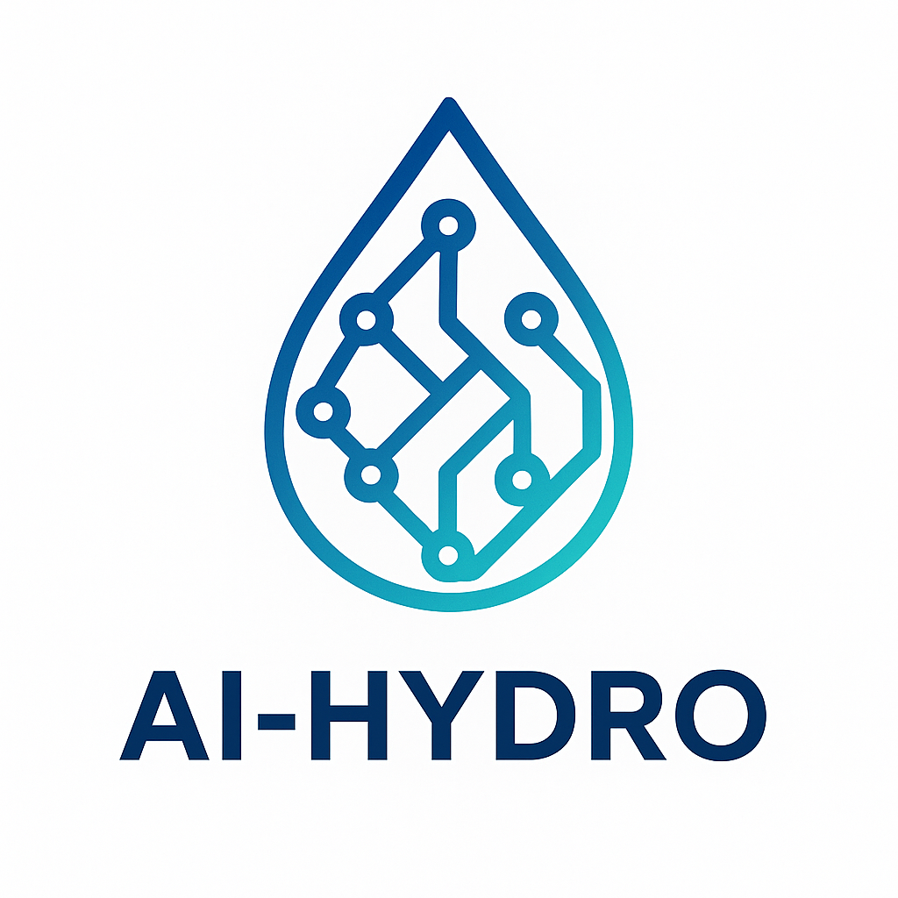

# AI-Hydro — Intelligent Research Platform for Hydrology

<p align="center">
  
</p>

<div align="center">

[](https://github.com/galib9690/AI-Hydro/releases)
[](./LICENSE)
[](https://www.python.org/)
[](https://code.visualstudio.com/)

</div>

<div align="center">
<table><tbody>
<td align="center"><a href="https://github.com/galib9690/AI-Hydro"><strong>GitHub</strong></a></td>
<td align="center"><a href="https://github.com/galib9690/AI-Hydro/issues"><strong>Issues</strong></a></td>
<td align="center"><a href="https://github.com/galib9690/AI-Hydro/discussions"><strong>Discussions</strong></a></td>
<td align="center"><a href="./docs/quickstart.md"><strong>Quick Start</strong></a></td>
<td align="center"><a href="./docs/tools-reference.md"><strong>Tools Reference</strong></a></td>
</tbody></table>
</div>

---

## What is AI-Hydro?

**AI-Hydro** is a VS Code extension that gives AI assistants (Claude, GPT-4, Gemini, etc.) direct access to 17 specialized hydrological research tools. Instead of writing boilerplate data-fetching code, you describe what you need in plain language and the AI calls the right tools automatically.

```
You: "Delineate the watershed for USGS gauge 01031500, fetch 10 years of
     GridMET forcing, and calibrate a differentiable HBV model."

AI-Hydro: [calls delineate_watershed → fetch_forcing_data → train_hydro_model]
          Watershed: 769 km², Piscataquis River ME
          HBV calibration complete: NSE = 0.638, KGE = 0.644
```

**Key differentiator:** AI-Hydro is not a chatbot that writes Python scripts for you to run separately. The AI directly invokes production-quality tools via the [Model Context Protocol (MCP)](https://modelcontextprotocol.io/), getting real results back in the same conversation.

---

## Features

### 17 Built-in Hydrological Tools

| Category               | Tools                                                                                        |
| ---------------------- | -------------------------------------------------------------------------------------------- |
| **Watershed**    | `delineate_watershed` — NHDPlus delineation from USGS NLDI                                |
| **Streamflow**   | `fetch_streamflow_data` — USGS NWIS daily discharge                                       |
| **Signatures**   | `extract_hydrological_signatures` — 15+ flow stats (BFI, runoff ratio, FDC)               |
| **Geomorphic**   | `extract_geomorphic_parameters` — 28 basin morphometry metrics                            |
| **Terrain**      | `compute_twi` — Topographic Wetness Index from 3DEP DEM                                   |
| **Curve Number** | `create_cn_grid` — NRCS CN grid from NLCD land cover + Polaris soils                      |
| **Forcing**      | `fetch_forcing_data` — GridMET basin-averaged climate (prcp, tmax, tmin, PET, srad, wind) |
| **CAMELS**       | `extract_camels_attributes` — Full CAMELS-US attribute set via pygeohydro                 |
| **Knowledge**    | `query_hydro_concepts` — RAG search over hydrological literature                          |
| **Modelling**    | `train_hydro_model` — Differentiable HBV-light or NeuralHydrology LSTM                    |
| **Modelling**    | `get_model_results` — Retrieve cached NSE / KGE / RMSE                                    |
| **Session**      | `start_session`, `get_session_summary`, `clear_session`                                |
| **Session**      | `add_note`, `export_session`, `sync_research_context`                                  |

### Research Session Memory

AI-Hydro caches every tool result in a **HydroSession** (JSON file per gauge). Expensive computations — watershed delineation (~10s), 10-year streamflow download (~5s) — are done once and reused across conversations.

```
Session 01031500  [updated 2026-03-06]
  Computed (7): watershed, streamflow, signatures, geomorphic, camels, forcing, model
  Pending  (1): twi

  Watershed area:    769.0 km²  (HUC-02: 01)
  Streamflow record: 3,652 days
  Baseflow index:    0.61
  HBV differentiable: NSE=0.638, KGE=0.644
```

### Differentiable HBV-Light

The built-in `train_hydro_model` tool uses a pure-PyTorch differentiable HBV-light:

- 12 physically-meaningful calibrated parameters
- Multi-restart Adam optimiser with cosine annealing
- Automatic CAMELS streamflow via `pygeohydro` for 671 CONUS gauges
- Typical performance: NSE 0.55–0.80

### Works with Any AI Provider

Configure any supported model in the Settings panel:

| Provider           | Recommended model       |
| ------------------ | ----------------------- |
| Anthropic          | Claude Sonnet 4.5 / 4.6 |
| OpenAI             | GPT-4o                  |
| Google             | Gemini 2.0 Flash        |
| AWS Bedrock        | Claude on Bedrock       |
| Ollama / LM Studio | Local models            |

---

## Installation

### Prerequisites

- VS Code 1.84+
- Python 3.10+ (Miniconda or system)
- An API key for at least one AI provider

### Step 1 — Install the VS Code Extension

**Option A — VS Code Marketplace** *(coming soon)*

**Option B — Install from `.vsix`**

1. Download the latest `.vsix` from [Releases](https://github.com/galib9690/AI-Hydro/releases)
2. In VS Code: `Extensions` → `...` → `Install from VSIX...`

**Option C — Build from source**

```bash
git clone https://github.com/galib9690/AI-Hydro.git
cd AI-Hydro
npm run install:all
npm run package          # produces ai-hydro-*.vsix
```

Then install the generated `.vsix` as above.

### Step 2 — Install the Python MCP Server

```bash
# Clone or navigate to the AI-Hydro repository
cd AI-Hydro/python

# Install the package and its dependencies
pip install -e .

# Register the MCP server with the AI-Hydro extension
python setup_mcp.py --ide vscode
```

> **Other IDEs:**
>
> ```bash
> python setup_mcp.py --ide cline         # Cline extension
> python setup_mcp.py --ide claude-code   # Claude Code CLI
> ```

### Step 3 — Configure Your AI Provider

1. Click the **AI-Hydro icon** in the VS Code sidebar
2. Open **Settings** (gear icon)
3. Select your provider and enter your API key
4. Click **Save**

### Step 4 — Verify

```bash
python setup_mcp.py --check
```

Should print `17 tools registered` and `Server started OK`.

See [docs/installation.md](./docs/installation.md) for detailed platform-specific instructions.

---

## Quick Start

Once installed, open the AI-Hydro chat panel and try:

```
Start a research session for USGS gauge 01031500 and delineate its watershed.
```

Then continue naturally:

```
Now fetch 10 years of GridMET forcing data and extract hydrological signatures.
```

```
Train a differentiable HBV model and show me the performance metrics.
```

```
Export the full session methods paragraph for my paper.
```

See [docs/quickstart.md](./docs/quickstart.md) for a complete walkthrough.

---

## Architecture

```
┌──────────────────────────────────────────────────────┐
│  VS Code Extension  (TypeScript / React)             │
│   Chat panel · Settings · Map panel · MCP client     │
└───────────────────────────┬──────────────────────────┘
                            │  Model Context Protocol (stdio)
                            ▼
┌──────────────────────────────────────────────────────┐
│  Python MCP Server  (python/mcp_server.py)           │
│   17 tools · HydroSession · FAIR provenance          │
└───────┬──────────────┬──────────────┬────────────────┘
        │              │              │
   USGS NWIS      GridMET API    pygeohydro
   NHDPlus         3DEP DEM      CAMELS data
   NLDI            MODIS         PyTorch HBV
```

The extension acts as an MCP **client**: when the AI decides to call `delineate_watershed`, it sends a JSON-RPC request to the Python server, which fetches real data from USGS/GridMET/etc. and returns structured results. No code generation needed — just direct tool calls.

Full architecture details: [docs/architecture.md](./docs/architecture.md)

---

## Documentation

| Document                                          | Description                               |
| ------------------------------------------------- | ----------------------------------------- |
| [docs/installation.md](./docs/installation.md)       | Platform-specific install guide           |
| [docs/quickstart.md](./docs/quickstart.md)           | First research session walkthrough        |
| [docs/tools-reference.md](./docs/tools-reference.md) | All 17 tools with parameters and examples |
| [docs/architecture.md](./docs/architecture.md)       | System design and data flow               |
| [CONTRIBUTING.md](./CONTRIBUTING.md)                 | How to contribute                         |

---

## Citation

If you use AI-Hydro in your research, please cite:

```bibtex
@software{aihydro2025,
  title   = {AI-Hydro: An Intelligent Computational Research Platform for Hydrology},
  author  = {Galib, Mohammad},
  year    = {2025},
  url     = {https://github.com/galib9690/AI-Hydro},
  version = {1.0.0-alpha}
}
```

---

## Built on Open Source

AI-Hydro is a domain-specific fork of [Cline](https://github.com/cline/cline) (Apache 2.0).
We are grateful to the Cline team for building the agentic VS Code framework.

Python data access is powered by [HyRiver](https://hyriver.readthedocs.io/) (pygeohydro, pynhd, py3dep, pygridmet) and [PyTorch](https://pytorch.org/).

---

## License

[Apache 2.0](./LICENSE) © 2026 Mohammad Galib

---

## Support

- **Bugs / questions**: [GitHub Issues](https://github.com/galib9690/AI-Hydro/issues)
- **Ideas**: [GitHub Discussions](https://github.com/galib9690/AI-Hydro/discussions)
- **Email**: mgalib@purdue.edu
